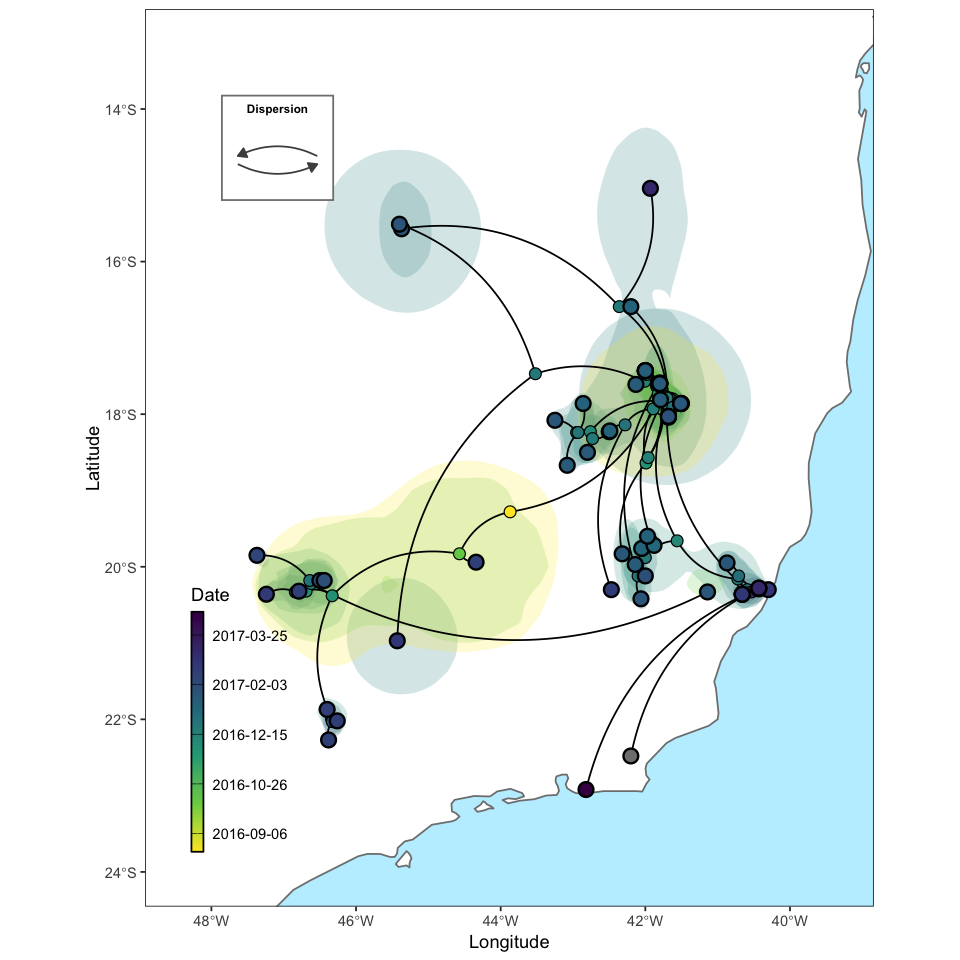
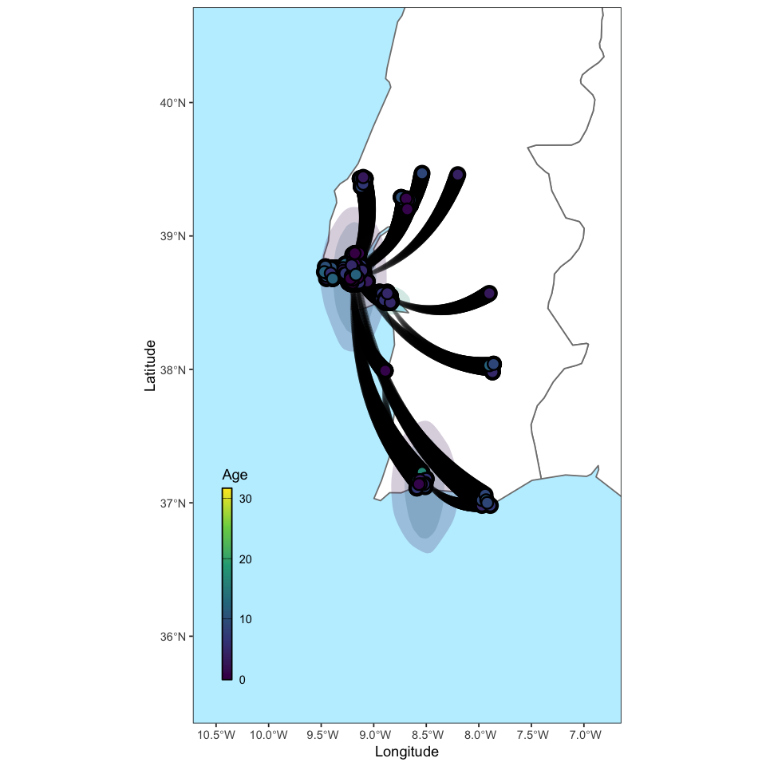
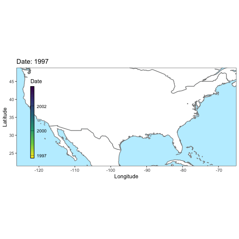
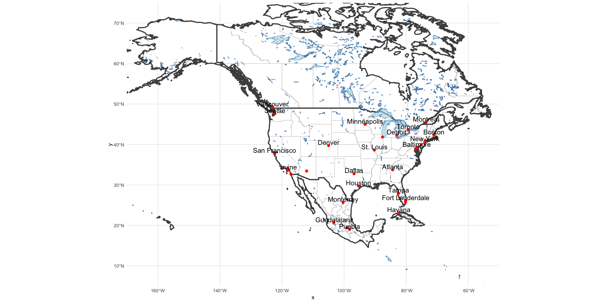
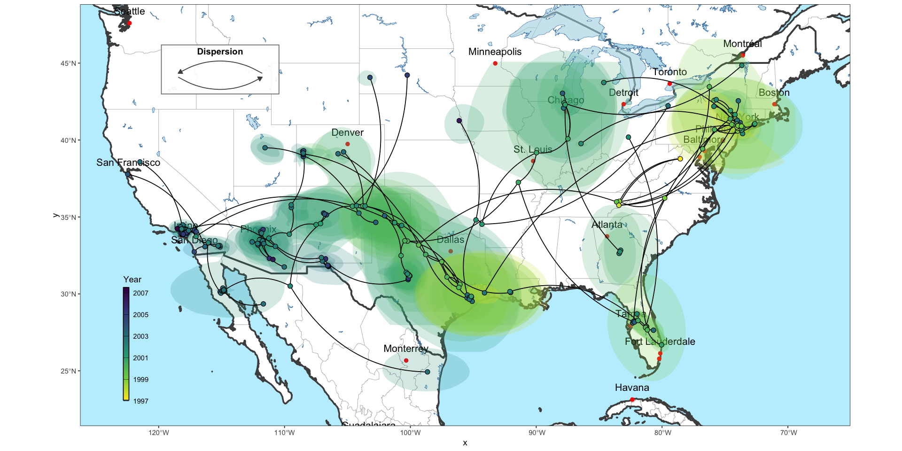
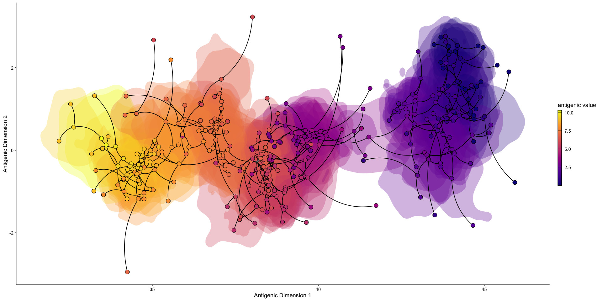
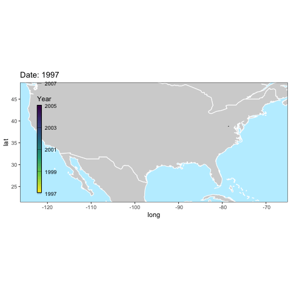
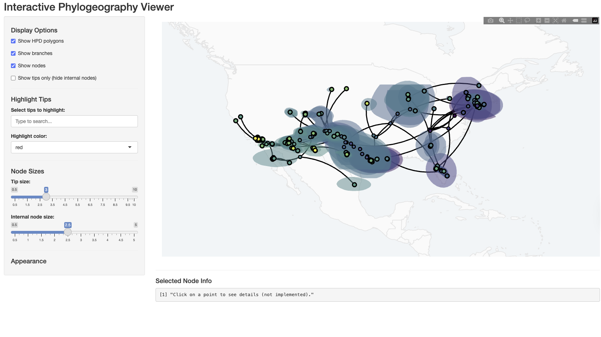

# ggphylogeo

<!-- badges: start -->

[](https://github.com/Joon-Klaps/ggphylogeo/actions/workflows/R-CMD-check.yaml)
[](https://codecov.io/gh/Joon-Klaps/ggphylogeo)

<!-- badges: end -->

ggplot2 extensions for visualising continuous phylogeographic
reconstructions from BEAST.

## Installation

```r
# Install from GitHub
remotes::install_github("Joon-Klaps/ggphylogeo")
```

## Features

- **Quick visualization** with `autoplot()` for immediate results
- **Component-based plotting** with individual geoms for full customization
- **Interactive exploration** with Shiny app
- **Animation support** for temporal visualization
- **Non-geographic data** support (e.g., antigenic cartography)

## Quick Start

Visualize a BEAST MCC tree immediately with `autoplot`:

```r
library(ggphylogeo)

# Load bundled example data
data(yfv_tree)

# Basic plot with date calibration
autoplot(yfv_tree, most_recent_sample = "2017-04-22")
```



or with thicker branches, use the option 'stream = TRUE':

```
data(hiv1_tree)
autoplot.treedata(hiv1_tree, show_dispersion_legend=FALSE, stream=TRUE)
```



## Detailed Plotting

For custom visualizations, build plots layer by layer using the three main geoms:

- `geom_phylo_branches()` - Plot tree branches as curves
- `geom_phylo_hpd()` - Plot uncertainty regions (HPD polygons)
- `geom_phylo_nodes()` - Plot nodes and tips

The `build_phylogeo()` function prepares the data for plotting, returning
`branches`, `nodes`, and `hpd` data frames (as well as `viewbox` to set map limits).

```r
library(ggphylogeo)
library(ggplot2)

# Load example data
data(wnv_tree)

# Extract phylogeographic components
pgeo <- build_phylogeo(wnv_tree, most_recent_sample = "2007-07-01")

# Build custom plot
ggplot() +
  geom_polygon(
    data = map_data("world"),
    aes(x = long, y = lat, group = group),
    fill = "white", color = "lightgray"
  ) +
  geom_phylo_hpd(data = pgeo$hpd, alpha = 0.2) +
  geom_phylo_branches(data = pgeo$branches) +
  geom_phylo_nodes(data = pgeo$nodes, size = 2.5) +
  scale_fill_viridis_c(
    name = "Year",
    direction = -1,
    labels = function(x) format(as.Date(x), "%Y"),
    breaks = seq(as.Date("1997-01-01"), as.Date("2008-01-01"), by = "2 year")
  ) +
  coord_sf(xlim = pgeo$viewbox$xlim, ylim = pgeo$viewbox$ylim) +
  theme_phylogeo() +
  guides_phylogeo()
```



> Note: This code was for a static plot, the gif shows an animated version, see below.

One can also further customize the plot with more detailed map backgrounds from `rnaturalearth` and its `sf` objects.

### Downloading Map Data

```r
library(rnaturalearth)
library(dplyr)
# Get countries using ne_download
countries <- ne_download(scale = 10, type = "countries", category = "cultural", returnclass = "sf")

# Filter for US, Mexico, Canada, Cuba
north_america <- countries[countries$ADMIN %in% c("United States of America", "Mexico", "Canada", "Cuba"), ]

# Or if you want state/province level detail
states <- ne_download(scale = 10, type = "admin_1_states_provinces", category = "cultural", returnclass = "sf")

# Filter for the three countries
north_am_states <- states[states$admin %in% c("United States of America", "Mexico", "Canada", "Cuba"), ]
# 2. Lakes
lakes <- ne_download(scale = 10, type = "lakes", category = "physical", returnclass = "sf")

# 3. Major cities
cities <- ne_download(scale = 10, type = "populated_places", category = "cultural", returnclass = "sf")
```

### Using sf Map Data in ggplot2

```r
mapplot <- ggplot() +
  # State borders (thin, light)
  geom_sf(data = north_am_states, fill = "white", color = "gray70", size = 0.2) +
  # Country borders (thick, dark) - add this layer on top
  geom_sf(data = north_america, fill = NA, color = "gray30", size = 1) +
  # Lakes
  geom_sf(data = lakes, fill = "lightblue", color = "steelblue", alpha = 0.6) +
  # Cities
  geom_sf(data = cities[cities$ADM0NAME %in% c("United States of America", "Mexico", "Canada", "Cuba") &
                        cities$POP_MAX > 2000000, ],
          color = "red", size = 2) +
  # City labels
  geom_sf_text(data = cities[cities$ADM0NAME %in% c("United States of America", "Mexico", "Canada", "Cuba") &
                             cities$POP_MAX > 2000000, ],
               aes(label = NAME),
               size = 4.5, nudge_y = 0.8, check_overlap = TRUE)

mapplot +
    coord_sf(xlim = c(-170, -50), ylim = c(5, 75), expand = FALSE) +
    theme_minimal()
```



### Plotting the phylogeo layers on top of the map

```r
data(wnv_tree)
wnv_phylogeo <- build_phylogeo(wnv_tree, most_recent_sample = "2007-07-01")

wnv_plot <- mapplot +
    geom_phylo_hpd(data = wnv_phylogeo$hpd, alpha = 0.2) +
    geom_phylo_branches(data = wnv_phylogeo$branches) +
    scale_fill_viridis_c(name="Year", direction= -1,
      labels = function(x) format(as.Date(x), "%Y"),
      breaks =  seq(as.Date("1997-01-01"), as.Date("2008-01-01"),by = "2 year")
    ) +
    theme_phylogeo() +
    guides_phylogeo() +
    coord_sf(
      xlim = wnv_phylogeo$viewbox$xlim,
      ylim = wnv_phylogeo$viewbox$ylim
    )

wnv_plot +
    geom_phylo_nodes(data = wnv_phylogeo$nodes, size = 2.5) +
    add_dispersion_legend(wnv_phylogeo$viewbox, text_size = 4 )
```



## Non-Geographic Data

The package also works with continuous trait data that isn't geographic.
For example, visualizing antigenic cartography:

```r
library(ggphylogeo)
library(ggplot2)

# Load H3N2 antigenic data
data(h3n2_tree)

# Use antigenic dimensions instead of geographic coordinates
pgeo <- build_phylogeo(h3n2_tree, lon = "antigenic1", lat = "antigenic2")

ggplot() +
  geom_phylo_hpd(data = pgeo$hpd, alpha = 0.3, smooth = FALSE) +
  geom_phylo_branches(data = pgeo$branches) +
  geom_phylo_nodes(data = pgeo$nodes, size = 3.5) +
  scale_fill_viridis_c(name = "Antigenic value", direction = 1, option = "plasma") +
  theme_phylogeo() +
  theme_classic() +
  guides_phylogeo() +
  labs(x = "Antigenic Dimension 1", y = "Antigenic Dimension 2")
```



## Animation

Create animated visualizations showing temporal progression:

```r
library(ggphylogeo)
library(gganimate)

data(wnv_tree)

# Create animation with autoplot
anim <- autoplot(
  wnv_tree,
  most_recent_sample = "2007-07-01",
  animate = TRUE,
  nframes = 300,
  show_dispersion_legend = FALSE
)

# Save animation
anim_save("wnv_animation.gif", animation = anim)
```

Or build animations manually for full control:

```r
pgeo <- build_phylogeo(wnv_tree, most_recent_sample = "2007-07-01")

p <- ggplot() +
  geom_polygon(
    data = map_data("world"),
    aes(x = long, y = lat, group = group),
    fill = "lightgray", color = "white"
  ) +
  geom_phylo_hpd(data = pgeo$hpd, alpha = 0.2, smooth = FALSE) +
  geom_phylo_branches(data = pgeo$branches) +
  scale_fill_viridis_c(name = "Year", direction = -1) +
  theme_phylogeo() +
  coord_sf(xlim = pgeo$viewbox$xlim, ylim = pgeo$viewbox$ylim) +
  gganimate::transition_reveal(age) +
  labs(title = "Date: {format(as.Date(frame_along, origin='1970-01-01'), '%Y')}")

anim <- gganimate::animate(p, nframes = 400, fps = 20)
anim_save("wnv_animation_manual.gif", animation = anim)
```



## Interactive Shiny App

Explore phylogeographic data interactively:

```r
library(ggphylogeo)

data(wnv_tree)

# Launch interactive viewer
run_phylogeo_app(wnv_tree, most_recent_sample = "2007-07-01")
```



The Shiny app provides:

- Toggle visibility of HPD polygons, branches, and nodes
- Highlight specific tips
- Adjust node sizes
- Interactive zooming and panning

## Bundled Datasets

The package includes example BEAST MCC trees:

| Dataset     | Description                       | Use                       |
| ----------- | --------------------------------- | ------------------------- |
| `wnv_tree`  | West Nile Virus, North America    | Geographic phylogeography |
| `yfv_tree`  | Yellow Fever Virus, South America | Geographic phylogeography |
| `hiv1_tree` | HIV-1 subtype G                   | Geographic phylogeography |
| `h3n2_tree` | H3N2 Influenza                    | Antigenic cartography     |

```r
# Load any bundled dataset
data(wnv_tree)
data(yfv_tree)
data(hiv1_tree)
data(h3n2_tree)
```

## Contributing & Development

Contributions are welcome! Please fork the repository and submit a pull request.

### Development Setup

```r
# Load all functions during development
devtools::load_all()

# Run tests
devtools::test()

# Check package
devtools::check()

# Build package
devtools::build()
```

### Tested Environment

This package was developed and tested with:

- R 4.4.3
- ggplot2 4.0.1
- treeio 1.30.0
- sf 1.0-24
- smoothr 1.2.1
- gganimate 1.0.11
- shiny 1.12.1

## License

MIT License - see [LICENSE](LICENSE) for details.
